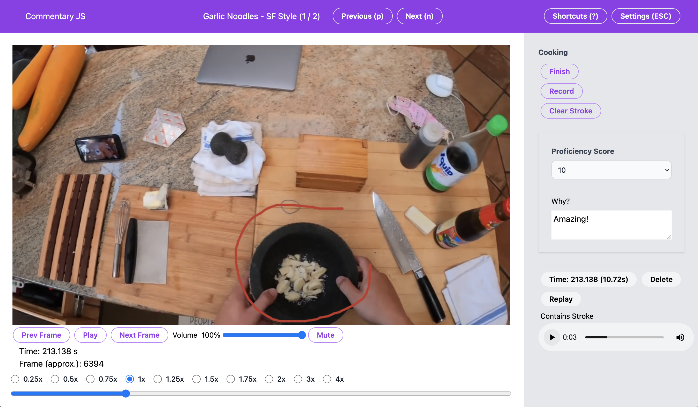

# Commentary JS

Try it [yourself](commentaryjs.miguel-martin.com) with user id
"kenji" (yes this is referencing the [chef](https://www.youtube.com/@JKenjiLopezAlt)). Use Chrome.



Commentary JS is video annotation tool that enables you to perform audio commentary on top of
videos, optionally with spatial drawings. A variant of this tool was used for
[Ego-Exo4D](https://docs.ego-exo4d-data.org/)'s [Expert
Commentary](https://docs.ego-exo4d-data.org/annotations/expert_commentary/)
annotations.

This is a port of the
[epic-kitchens-100-commentary](https://github.com/epic-kitchens/epic-kitchens-100-commentary)
to JavaScript. 

The tech-stack is simple:
- [Tailwind-CSS](https://tailwindcss.com/) for styling
- JS and HTML for the UI code: ~1.8K LOC
- Python for the backend. Videos must be hosted on S3-compatible storage.

# Additional Contributors

- https://github.com/ChanganVR

## setup

### data

You will need to:
1. Have S3-compatible storage somewhere, e.g. AWS S3, Digitial Ocean Spaces, etc.
2. Generate metadata, see [backend/data.py](./backend/data.py)'s `create_sample_data` function to see what is expected.

### backend

Use nvm to manage node (`nvm use stable`), or use bun instead of npm.
```
npm install
```

server:

```
conda create -n commentary_js python=3.11 -y
conda activate commentary_js
pip install -r requirement.txt
```

run the server:
```
npm run dev
```

### deployment

There is example Terraform configuration in [./tf](./tf) for Digital Ocean.

# dev docs

See [docs/dev.md](./docs/dev.md)
